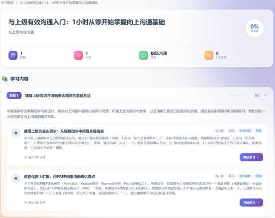
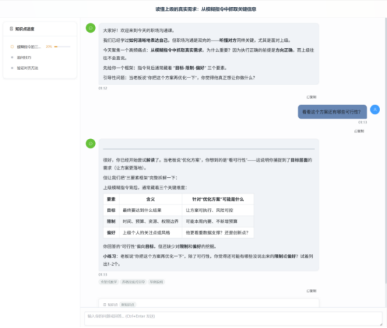
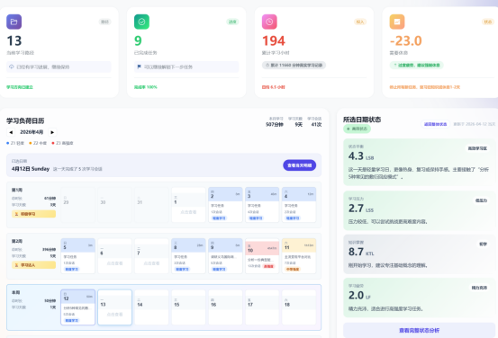
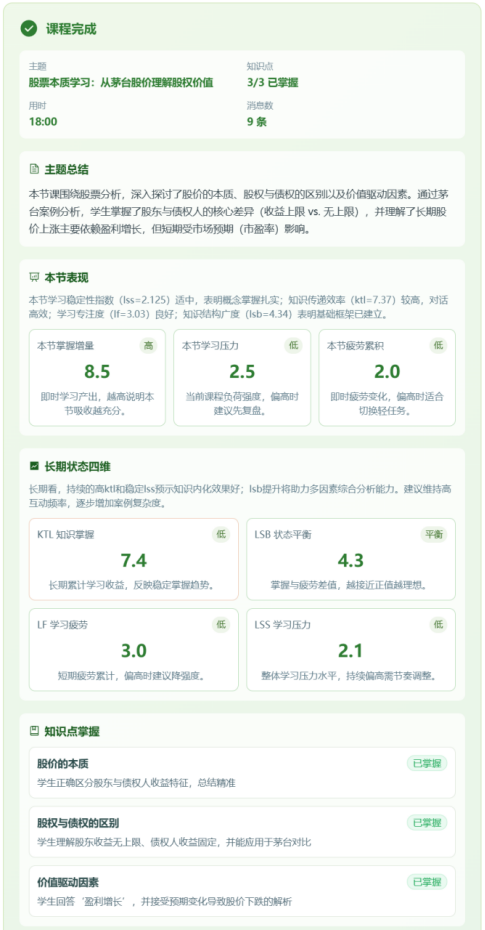

<<<<<<< HEAD
# WenFlow

**面向不确定性的智能学习平台**

> 问流 - 在 AI 时代，学会提出比解答更重要的问题

🌐 **官网**: https://wenflow.org

> 仅作 Demo 演示，不提供正式服务。

**测试账号**: `123`
**测试密码**: `123456`

[](LICENSE)
[](https://nodejs.org)
[](https://vuejs.org)

---

## 为什么存在？

当 AI 能解答所有标准问题，**提出好问题的人，将定义未来。**

传统教育教的是工具（技）——循环怎么写、单词怎么拼、标准答案是什么。  
WenFlow 教的是思维（道）——看到联系、识别模式、系统思考、定义问题。

**工具会过时，思维永流传。**

---

## 核心特性

### 界面预览

| 首页 | 学习路径 | 教学对话 |
|:---:|:---:|:---:|
|  |  |  |

| 状态追踪 | 评价反馈 |
|:---:|:---:|
|  |  |

### 对话式学习
- **目标收集**：5-8 轮自然对话，澄清真正想学什么
- **路径生成**：模糊目标 → 可执行任务，动态难度调整
- **交互学习**：Round-based 模式，AI 提问 → 用户回答 → 即时反馈

### 学习状态追踪
借鉴运动科学量化模型，科学追踪学习效果：

| 指标 | 含义 | 用途 |
|------|------|------|
| LSS | 学习压力评分 | 基于任务难度、时长、认知负荷 |
| KTL | 知识掌握度 | 长期积累，42天衰减因子 0.95 |
| LF | 学习疲劳度 | 短期累计，7天衰减因子 0.70 |
| LSB | 学习状态平衡 | KTL - LF，预警过度学习 |

---

## 技术栈

| 层级 | 技术 |
|------|------|
| **前端** | Vue 3 + TypeScript + Vite 5 + Element Plus + Pinia |
| **后端** | Node.js + Express + TypeScript + Prisma |
| **数据库** | PostgreSQL (生产) / SQLite (开发) |
| **AI** | DeepSeek / GLM / Gemini（兼容 OpenAI API） |
| **容器** | Docker + Docker Compose + Nginx |

---

## 项目状态

本项目目前处于**原始开发状态**，是一个验证教学概念的实验性产物。

市面上有太多AI工具教你怎么写代码、怎么用软件，却很少有人教你：**在AI时代，真正需要什么样的思维**。

WenFlow尝试回答这个问题。我们不追求"提高学习效率"——那是工业时代的思维。我们追求的是培养AI时代需要的**问题定义能力、系统思维、判断力、AI协作力、创造力**。

这个项目是一个验证：如果把教育重心从"工具技能"转向"思维方式"，会发生什么？

---

## 快速开始

### 环境要求
- Node.js >= 18
- PostgreSQL（生产环境）

### 一键启动（开发环境）

```bash
# Windows
start-dev.bat

# 或 PowerShell
./start-dev.ps1
```

### 手动启动

```bash
# 后端
cd backend
npm install
cp .env.example .env
npx prisma generate
npx prisma db push
npm run dev

# 前端
cd frontend
npm install
cp .env.example .env
npm run dev
```

### 访问地址

**生产环境**: https://wenflow.org

**开发环境**
- 前端: http://localhost:5173
- 后端: http://localhost:3001
- 管理后台: http://localhost:5173/admin

---

## 管理员账户

首次部署后，需要创建管理员账户：

```bash
cd backend
npx ts-node scripts/create-admin.ts <用户名> <密码>
```

详见 [ADMIN_SETUP.md](ADMIN_SETUP.md)

---

## 教育理论基础

基于 6 大教育理论：

1. **认知负荷理论** - 避免信息过载
2. **自我导向学习** - 用户自主决定
3. **Dreyfus 五阶段模型** - 动态评估用户阶段
4. **最近发展区 + 支架** - 难度略高于当前水平
5. **形成性评估** - 即时反馈
6. **刻意练习** - 针对弱点突破

---

## License

本项目采用 [MIT License](LICENSE) 开源协议。

Copyright (c) 2026 wenflow-org

---

## 致谢

感谢 [Linux.do](https://linux.do/) 佬友们的一切分享。

---

*当 AI 能解答所有标准问题，提出好问题的人，将定义未来。*
=======
# KnowPath
an agent product for education
>>>>>>> 60a959f8eff21ac9e6989eb450fea683c0a2f6f5
