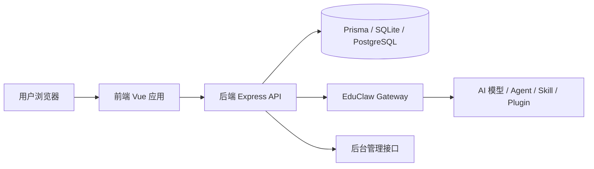
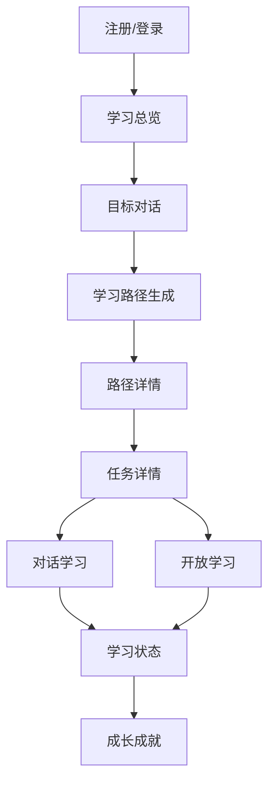

# 知途（KnowPath）软件设计说明书

## 1. 引言
### 1.1 编写目的
本文档按照软件设计流程，对知途（KnowPath）的产品定位、需求分析、总体架构、前后端设计、数据设计、接口设计、部署方案与当前验证情况进行系统说明，用于比赛答辩、项目交接和后续研发。

### 1.2 项目概述
知途（KnowPath）是一款面向复杂任务学习场景的 AI 学习平台。平台以“目标澄清、路径生成、对话学习、状态反馈”为主线，帮助用户从模糊想法逐步走到清晰路径，并在执行过程中获得 AI 陪练与反馈。

### 1.3 术语说明
- **知途（KnowPath）**：当前统一产品名称
- **WenFlow / 问流**：历史仓库名称
- **目标对话**：通过多轮问答澄清真实目标、基础、时间与限制条件的过程
- **学习路径**：根据目标自动生成的阶段化计划
- **对话学习**：围绕具体任务进行的轮次化互动学习
- **开放学习**：自由提问、自由探索的 AI 学习模式
- **学习状态**：围绕认知负荷、知识迁移、学习流、学习平衡等指标的展示模块

## 2. 作品应用场景
### 2.1 典型场景
1. **竞赛项目拆解**：用户知道要做项目，但不知道先做什么、如何拆阶段。
2. **自主学习规划**：用户需要围绕结果导向任务来安排学习，而不是零散刷知识点。
3. **跨学科任务推进**：同时涉及技术、产品、设计、表达等多个维度的学习。
4. **过程陪练与反馈**：用户需要在推进过程中被追问、被校正、被提示。
5. **教学辅助场景**：适合训练营、辅导课、课程项目等需要过程追踪的场景。

### 2.2 目标用户
- 大学生、竞赛参与者、项目制学习者
- 目标模糊但任务明确的自学者
- 需要 AI 陪练和学习节奏反馈的用户
- 需要观测平台运行状态的管理员和运营人员

### 2.3 业务价值
- 把“我想做什么”转化为“我下一步做什么”
- 把“模糊目标”转化为“清晰路径”
- 把“看资料”转化为“互动推进”
- 把“做没做完”转化为“进度和状态都可视”

## 3. 设计理念
### 3.1 核心理念
知途不是一个简单聊天框，而是一个围绕“**目标澄清 → 路径规划 → 任务推进 → 状态反馈**”构建的学习工作台。

### 3.2 设计原则
1. **先理解，再规划**：先洞察用户真实目标，再生成学习路径。
2. **以任务推进为核心**：围绕成果和行动，而不是堆叠知识点。
3. **以对话组织学习**：通过多轮互动替代单次静态回答。
4. **过程可反馈**：学习不仅有结果，也要有状态可观测。
5. **工程可扩展**：前后端分离、组件化、服务化，便于持续演进。

### 3.3 界面理念
- 用户端强调沉浸式工作流
- 后台端强调清晰、可运维、可观测
- 全站统一中文文案与品牌语言
- 组件、颜色、间距、交互状态统一治理

## 4. 需求分析
### 4.1 功能需求
#### 4.1.1 用户侧
- 注册、登录、身份保持
- 学习总览与个人状态入口
- 目标对话与路径生成
- 路径列表、路径详情、任务详情
- 对话学习、开放学习
- 学习状态、成长成就
- 个人资料、接口设置、运行日志

#### 4.1.2 管理侧
- 管理员登录
- 平台概览
- 用户管理
- 接口配置
- 执行日志

#### 4.1.3 AI / 业务能力
- 目标澄清式问答
- 路径生成与任务拆解
- 对话式教学轮次管理
- 开放学习会话编排
- 学习状态跟踪和指标计算
- 智能体调用记录与平台观测

### 4.2 非功能需求
- 界面统一、中文化、可维护
- 路由结构清晰、页面可跳转
- 可运行、可构建、便于继续接真实接口
- 支持基础异常反馈与状态展示
- 适合作为比赛作品和后续产品原型

## 5. 总体设计
### 5.1 系统总体架构


### 5.2 分层说明
- **表示层**：Vue 页面、组件、路由、状态管理、样式系统
- **接口层**：前端 API 封装与后端 REST 路由
- **业务层**：学习路径、目标对话、对话学习、状态跟踪等服务
- **AI 编排层**：Gateway、Agents、模型调用与能力扩展
- **数据层**：Prisma 与数据库表结构

### 5.3 核心业务闭环


## 6. 前端设计
### 6.1 技术方案
- Vue 3
- TypeScript
- Vite 5
- Pinia
- Vue Router 4
- Element Plus
- Chart.js / vue-chartjs
- markdown-it、katex、highlight.js、mermaid

### 6.2 目录结构
```text
frontend/
  src/
    api/                # 接口封装
    components/aa/      # 统一设计系统组件
    router/             # 路由定义与守卫
    stores/             # Pinia 状态
    styles/             # 全局样式与设计 token
    utils/              # 工具方法
    views/              # 页面视图
      admin/            # 后台页面
      user/             # 用户辅助页面
```

### 6.3 主要页面
- 首页、登录、注册
- 学习总览
- 目标对话
- 学习路径列表与详情
- 任务详情
- 对话学习
- 开放学习
- 学习状态
- 成长成就
- 个人资料、接口设置、运行日志
- 后台登录、平台概览、用户管理、接口配置、执行日志、404

### 6.4 设计系统
`src/components/aa/` 和 `src/styles/main.css` 已构成统一设计系统，核心包括：
- 布局：`AppShell`、`AppTopNav`、`AppSideRail`、`AppAuthLayout`
- 基础操作：`AButton`
- 表单：`AField`
- 容器：`APanel`
- 统计：`AStatTile`、`AProgressBar`
- 状态：`AEmpty`、`ALoading`、`AErrorState`
- 交互层：`AConfirmDialog`

## 7. 后端设计
### 7.1 技术方案
- Node.js + Express
- TypeScript
- Prisma ORM
- JWT 鉴权
- bcrypt
- Winston
- Zod
- OpenAI 兼容接口 / 模型网关

### 7.2 目录结构
```text
backend/
  src/
    index.ts
    routes/
    services/
    gateway/
    agents/
    middleware/
    scripts/
  prisma/
    schema.prisma
```

### 7.3 主要路由模块
- `routes/auth.ts`
- `routes/learning.ts`
- `routes/goal-conversation.ts`
- `routes/ai-teaching.routes.ts`
- `routes/metrics.ts`
- `routes/achievements.ts`
- `routes/feedback.ts`
- `routes/admin/*`

### 7.4 关键服务
- `goal-conversation.service.ts`
- `learning.service.ts`
- `dialogue-learning.service.ts`
- `learning-state.service.ts`
- `state-tracking.service.ts`
- `AITeachingOrchestrator.ts`

### 7.5 AI 编排能力
后端通过 `gateway/index.ts` 中的 `EduClawGateway` 统一接入模型、agents、skills 和 plugins，并在 `agents/` 中组织多类智能体模块，为未来多智能体协同预留结构基础。

## 8. 数据设计
### 8.1 数据库方案
- 开发环境：SQLite
- 可扩展生产环境：PostgreSQL
- ORM：Prisma

### 8.2 核心实体
- 用户
- 学习目标
- 学习路径
- 阶段 / 周计划 / 任务
- 目标对话
- 学习会话
- 学习状态记录
- 成就记录
- 智能体调用日志
- 平台统计信息

## 9. 接口设计
### 9.1 鉴权接口
- `POST /api/auth/register`
- `POST /api/auth/login`
- `GET /api/auth/verify`

### 9.2 目标对话接口
- `POST /api/goal-conversation/start`
- `POST /api/goal-conversation/:conversationId/reply`
- `POST /api/goal-conversation/:conversationId/regenerate`
- `GET /api/goal-conversation/:conversationId`
- `POST /api/goal-conversation/quick-generate`

### 9.3 学习路径接口
- `GET /api/learning/goals`
- `GET /api/learning/paths`
- `POST /api/learning/paths/create`
- `POST /api/learning/paths/generate`
- `GET /api/learning/paths/:pathId`

### 9.4 对话学习接口
- `POST /api/learning/dialogue/start`  
  启动对话学习必须同时提供 `taskId` 与 `pathId`
- `POST /api/learning/dialogue/:sessionId/submit`
- `POST /api/learning/dialogue/:sessionId/hint`
- `POST /api/learning/dialogue/:sessionId/skip`
- `GET /api/learning/dialogue/:sessionId/state`

### 9.5 开放学习接口
- `POST /api/ai-teaching/sessions`
- `POST /api/ai-teaching/sessions/:sessionId/messages`
- `POST /api/ai-teaching/sessions/:sessionId/end`
- `GET /api/ai-teaching/state`
- `GET /api/ai-teaching/trends`

### 9.6 管理端接口
- `POST /api/admin/auth/login`
- `GET /api/admin/overview/stats`
- `GET /api/admin/activity`

## 10. 安全与权限设计
- 普通用户通过 JWT 登录鉴权
- 管理员通过独立后台入口登录
- 路由通过 `requiresAuth` / `requiresAdminAuth` 控制访问
- 密码加密存储，使用 CORS、helmet 和环境变量保护敏感配置

## 11. 部署设计
### 11.1 开发环境
- 前端：`frontend/` 执行 `npm run dev`
- 后端：`backend/` 执行 `npm run dev`
- Windows 可使用根目录 `start-dev.ps1` 一键启动

### 11.2 生产建议
- 前端静态资源由 Nginx 托管
- 后端使用 Node 独立部署
- 数据库迁移至 PostgreSQL
- 通过 `.env` 管理模型、数据库、管理员和跨域配置

## 12. 当前验证情况
### 12.1 已验证
- 前端主产品页面完成一轮系统化重构
- 品牌名统一为“知途（KnowPath）”
- 用户主链路与后台主链路已具备基本可交互性
- 对话学习页 `taskId/pathId` 参数缺失问题已修复
- 前端 `npm run build` 已通过

### 12.2 风险与约束
- 后端仍保留较多实验性模块，维护时需区分主链路与实验功能
- 旧文档存在部分编码历史问题，建议后续统一清理
- 前端仍有进一步拆包与性能优化空间

## 13. 后续优化方向
1. 继续压缩前端包体积
2. 深化开放学习、课堂测试等支链路联调
3. 增强后台运维与审计能力
4. 补充 API 文档、ER 图、测试说明
5. 将实验性模块进一步标记或下沉

## 14. 结论
知途（KnowPath）已经具备较完整的 AI 学习平台原型结构：应用场景明确、主链路闭环清晰、前后端可运行、界面与业务逻辑可继续扩展，既适合作为比赛作品，也适合作为后续产品化演进的工程底座。
